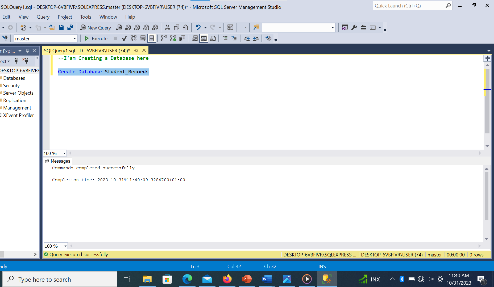
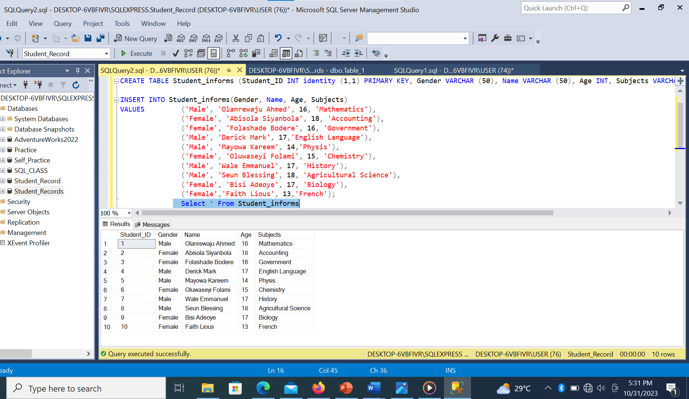
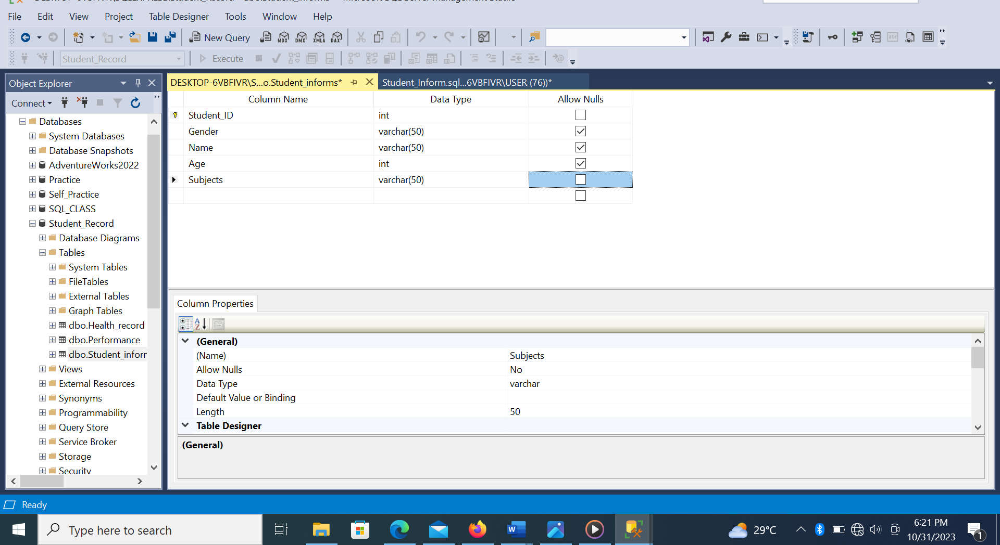
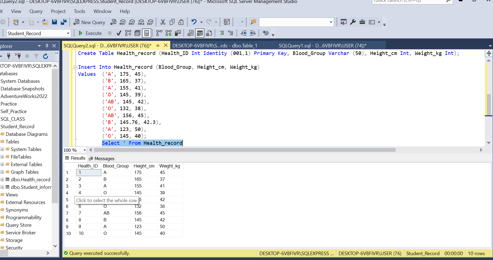
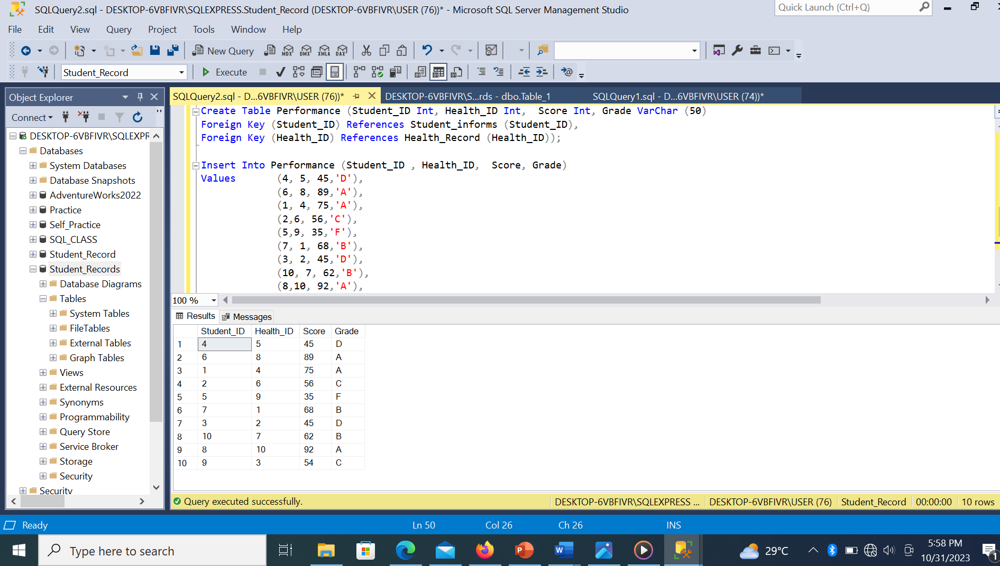
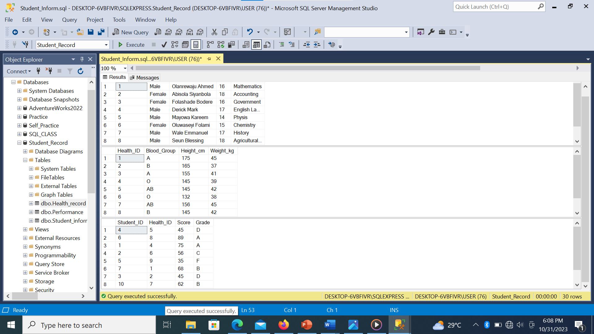
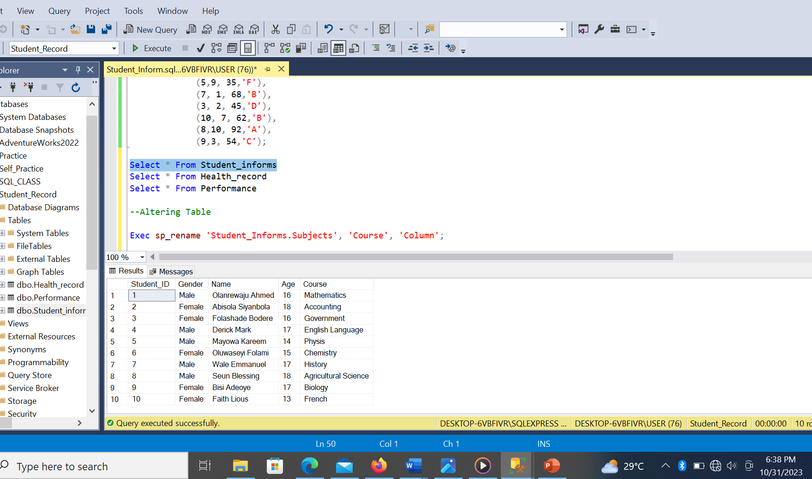
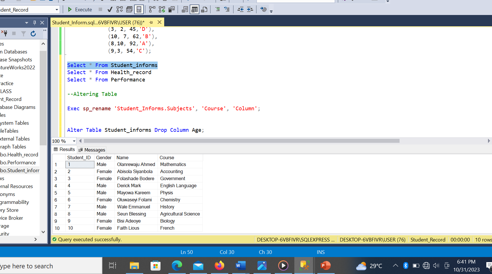

# Student Records Demo

## Introduction
	This project is an SQl project, the dataset is called Student Record. I created a database for student records and created Three (3) tables in the database. Some alteration were later made to some columns in some tables.
 
**_Disclamier_**:_All Dataset do not represent any individual, Institution or company ,but just a dummy set to demonstrate my knowledge of SQL_.

## Problem Statement

-	Create a Database named “Students Record”.
- Create the following tables in the database create.
- Students Info (Student ID PK, Gender, Name, Age, Subject).
- Health records (Health ID PK, Blood Group, Height, Weight).
- Performance (Student ID FK, HEALTH FK,  Score, Grade).
- The ID has to be unique
-	Add a constraint that prevents the ID and Subject from taking null values
-	Apply the following modifications to the table
1.	Change column name ‘’Subject” to ‘’Course” 
2.	Drop the “Age” column from the ‘Students Info’ table .

## Skill documented
These are some of the Sql Features used;
1.	Create Table
2.	Select * From
3.	Alter Table
4.	Add contraints

# Problem Solved
I create a Database named “Students Record” by Using the syntax;

Create Database Student Record

# Table 1

I created this Table “Student_Informs” by using the syntax;

CREATE TABLE Student_informs (Student_ID INT identity (1,1) PRIMARY KEY, Gender VARCHAR (50), Name VARCHAR (50), Age INT, Subjects VARCHAR (50));

I insert values into the table by using the syntax;

INSERT INTO Student_informs(Gender, Name, Age, Subjects)

VALUES  ('Male', 'Olanrewaju Ahmed', 16, 'Mathematics'),

	      ('Female', 'Abisola Siyanbola', 18, 'Accounting'),
      
       ('Female', 'Folashade Bodere', 16, 'Government'),
	     ('Male', 'Derick Mark', 17,'English Language'),
      
	    ('Male', 'Mayowa Kareem', 14,'Physis'),
     
	    ('Female', 'Oluwaseyi Folami', 15, 'Chemistry'),
     
	    ('Male', 'Wale Emmanuel', 17, 'History'),
     
	    ('Male', 'Seun Blessing', 18, 'Agricultural Science'),
     
      ('Female', 'Bisi Adeoye', 17, 'Biology'),
      
	    ('Female','Faith Lious', 13,'French');
      
The table has 5 columns, with each columns having is own data type. The column student_ID has unique values because it made with the constraint “IDENTITY” and is made a “primary key” because it is a “dimensional table”. The table has 10 row. I was able to view this table with the syntax; 

Select * From Student_informs. 

I made sure the columns Student_ID and Student does not accept null by going to the table and unstick null.

# Table 2

I created this Table “Health_record” by using the syntax;

Create Table Health_record (Health_ID Int Identity (001,1) Primary Key, Blood_Group Varchar (50), Height_cm Int, Weight_kg Int);

I inserted the values by using the syntax;

Insert Into Health_record (Blood_Group, Height_cm, Weight_kg)

Values  ('A', 175, 45),
      
        ('B', 165, 37),
        
        ('A', 155, 41),
        
        ('O', 145, 39),
        
        ('AB', 145, 42),
        
        ('O', 132, 38),
	   
       ('AB', 156, 45),
		 
       ('B', 145.76, 42.3),
        
        ('A', 123, 50),
        
        ('O', 145, 40);

The table has 4 columns, with each columns having is own data type. The column “Health_ID” has unique values because it made with the constraint “IDENTITY” and is made a “primary key” because it is a ”dimensional table”. The table also has 10 row. I was able to view this table with the syntax;

Select * From Health_record

# Table 3

I created this Table “Performance” by using the syntax;

Create Table Performance (Student_ID Int, Health_ID Int,  Score Int, Grade VarChar (50)

Foreign Key (Student_ID) References Student_informs (Student_ID),

Foreign Key (Health_ID) References Health_Record (Health_ID));

I inserted the values into the table by using the syntax:

Insert Into Performance (Student_ID , Health_ID,  Score, Grade)

Values       (4, 5, 45,'D'),
             
             (6, 8, 89,'A'),
             
             (1, 4, 75,'A'),
             
             (2,6, 56,'C'),
             
             (5,9, 35,'F'),
             
             (7, 1, 68,'B'),
             
             (3, 2, 45,'D'),
             
             (10, 7, 62,'B'),
             
             (8,10, 92,'A'),
             
             (9,3, 54,'C');
             
The table has 4 columns, with each columns having is own data type .In this table Student_ID and Health_ID is made a “foreign key” that references the table student_informs and Health_Record respectively  because it is a “Fact Table”. The table also has 10 row. I was able to view this table with the syntax;

Select * From Performance

# The three (3) Tables

## Altering table

I rename the subject column in the student_Inform table to course by using the syntax;
Exec sp_rename 'Student_Informs.Subjects', 'Course', 'Column';

I Drop the Column “Age” in the student_inform table by using the syntax;
Alter Table Student_informs Drop Column Age;

   

   

